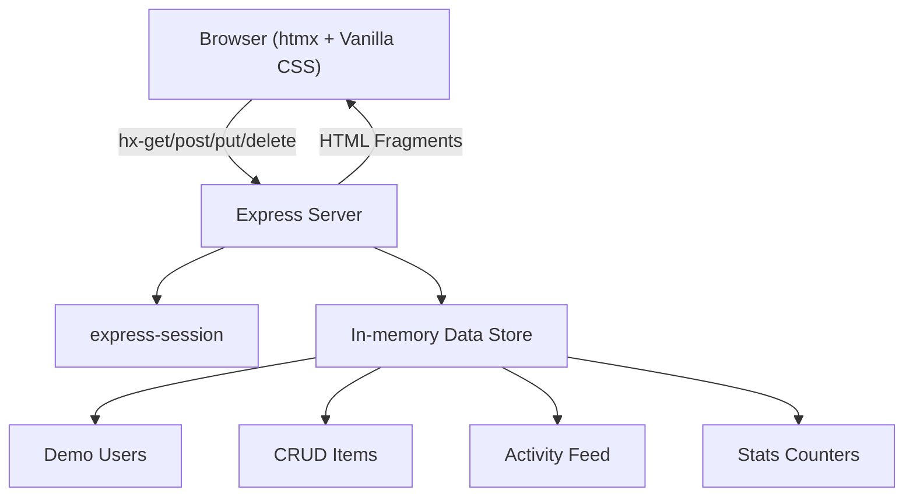

# htmx Showcase — "htmx Unleashed"

A comprehensive web application demonstrating htmx's full capabilities using **zero JavaScript frameworks** — just HTML attributes, vanilla CSS, and a lightweight Express backend.

## Design Decisions Summary

| Decision | Choice |
|---|---|
| Backend | Node.js + Express |
| Auth | express-session (server-side sessions) |
| htmx Inclusion | CDN `<script>` tag |
| Visual Style | Dark mode + vibrant neon/gradient accents |
| Animations | CSS View Transitions API + @keyframes micro-animations |
| Annotations | Collapsible code/explanation panels per feature |
| Navigation | Sidebar with links to each demo section |
| Demo Users | Hardcoded (`admin`/`admin123`, `user`/`user123`) |

---

## Architecture Overview



**Key principle**: The server returns **HTML fragments**, not JSON. Every interaction is driven by htmx attributes on HTML elements. No client-side JS framework code.

---

## Proposed Changes

### Project Setup & Configuration

#### [NEW] [package.json](file:///c:/Users/User/OneDrive/Desktop/CodeTest/htmx-master/package.json)
- `express`, `express-session`, `ejs` (for HTML templating)
- `npm start` script to launch the server
- `npm run dev` using `nodemon` for development

#### [NEW] [server.js](file:///c:/Users/User/OneDrive/Desktop/CodeTest/htmx-master/server.js)
- Express app setup with EJS templating
- Session configuration with `express-session`
- Static file serving for CSS/assets
- Auth middleware to protect dashboard routes
- ~25 route handlers for all htmx endpoints (detailed below)

---

### Views (EJS Templates)

All templates live in `/views`. The server renders full pages or HTML fragments depending on the request.

#### [NEW] [views/layout.ejs](file:///c:/Users/User/OneDrive/Desktop/CodeTest/htmx-master/views/layout.ejs)
- Base HTML layout with `<head>` (meta, fonts, CSS, htmx CDN script)
- CSS View Transitions meta tag
- Shared toast notification container
- `<%- body %>` placeholder for page content

#### [NEW] [views/login.ejs](file:///c:/Users/User/OneDrive/Desktop/CodeTest/htmx-master/views/login.ejs)
- **Login form** — `hx-post="/auth/login"`, `hx-target="#login-result"`, `hx-swap="innerHTML"`, `hx-indicator="#login-spinner"`
- **Username availability check** — input with `hx-get="/auth/check-username"`, `hx-trigger="keyup changed delay:500ms"`, `hx-target="#username-status"`
- **Password strength indicator** — input with `hx-post="/auth/password-strength"`, `hx-trigger="keyup changed delay:300ms"`, `hx-target="#password-strength"`
- **Remember me toggle** — checkbox with `hx-get="/auth/remember-me-info"`, `hx-target="#remember-info"`, `hx-swap="innerHTML transition:true"`
- **Register tab** — link/button using `hx-get="/auth/register/step/1"`, `hx-target="#auth-form-container"`, `hx-swap="innerHTML transition:true"` to load multi-step registration wizard
- Collapsible annotation panels under each section

#### [NEW] [views/register-step-1.ejs](file:///c:/Users/User/OneDrive/Desktop/CodeTest/htmx-master/views/partials/register-step-1.ejs)
#### [NEW] [views/register-step-2.ejs](file:///c:/Users/User/OneDrive/Desktop/CodeTest/htmx-master/views/partials/register-step-2.ejs)
#### [NEW] [views/register-step-3.ejs](file:///c:/Users/User/OneDrive/Desktop/CodeTest/htmx-master/views/partials/register-step-3.ejs)
- 3-step registration wizard, each step loaded via `hx-get`
- Step 1: Username + email
- Step 2: Password + confirm
- Step 3: Profile preferences + submit
- Progress bar updates with each step
- Back/Next navigation via `hx-get` to previous/next step

#### [NEW] [views/dashboard.ejs](file:///c:/Users/User/OneDrive/Desktop/CodeTest/htmx-master/views/dashboard.ejs)
- Sidebar navigation with links to each demo section
- Main content area with demo sections
- User greeting + logout button (`hx-post="/auth/logout"`, `hx-target="body"`)
- Toast notification container
- Theme toggle button

---

### Dashboard Demo Sections (Partials)

Each partial is an HTML fragment returned by the server. Each includes a collapsible code annotation panel.

#### [NEW] [views/partials/widgets.ejs](file:///c:/Users/User/OneDrive/Desktop/CodeTest/htmx-master/views/partials/widgets.ejs)
**Lazy-loaded Dashboard Widgets** — Demonstrates `hx-trigger="load"`
- 3-4 stat cards with `hx-get="/api/widget/:id"`, `hx-trigger="load"`, `hx-swap="innerHTML"`
- Each card shows a loading skeleton, then swaps in real content
- Showcases: `hx-get`, `hx-trigger="load"`, `hx-swap`, `hx-indicator`

#### [NEW] [views/partials/infinite-scroll.ejs](file:///c:/Users/User/OneDrive/Desktop/CodeTest/htmx-master/views/partials/infinite-scroll.ejs)
**Infinite Scroll Activity Feed** — Demonstrates `hx-trigger="revealed"`
- Activity log items with timestamps
- Sentinel element at bottom: `hx-get="/api/feed?page=N"`, `hx-trigger="revealed"`, `hx-swap="afterend"`, `hx-indicator="#feed-spinner"`
- Showcases: `hx-trigger="revealed"`, `hx-swap="afterend"`, pagination

#### [NEW] [views/partials/live-search.ejs](file:///c:/Users/User/OneDrive/Desktop/CodeTest/htmx-master/views/partials/live-search.ejs)
**Live Search** — Demonstrates debounced input triggers
- Search input: `hx-get="/api/search"`, `hx-trigger="keyup changed delay:300ms"`, `hx-target="#search-results"`, `hx-indicator="#search-spinner"`
- Results dropdown with highlighted matches
- Showcases: `hx-trigger` with modifiers, `hx-indicator`, `hx-target`

#### [NEW] [views/partials/crud-table.ejs](file:///c:/Users/User/OneDrive/Desktop/CodeTest/htmx-master/views/partials/crud-table.ejs)
**CRUD Table with Inline Editing** — Demonstrates full REST verbs + OOB swaps
- Table of items with edit/delete buttons
- Add row: `hx-post="/api/items"`, `hx-target="#item-table tbody"`, `hx-swap="beforeend"`
- Edit row: `hx-get="/api/items/:id/edit"` swaps row to editable form, save with `hx-put="/api/items/:id"`
- Delete row: `hx-delete="/api/items/:id"`, `hx-target="closest tr"`, `hx-swap="outerHTML swap:500ms"` (with fade animation)
- OOB swap to update item count: `hx-swap-oob="innerHTML:#item-count"`
- Showcases: `hx-post`, `hx-put`, `hx-delete`, `hx-target`, `hx-swap="outerHTML"`, `hx-swap-oob`, `hx-confirm`

#### [NEW] [views/partials/tabs.ejs](file:///c:/Users/User/OneDrive/Desktop/CodeTest/htmx-master/views/partials/tabs.ejs)
**On-Demand Tabs** — Demonstrates lazy content loading
- Tab bar with 3-4 tabs
- Each tab: `hx-get="/api/tabs/:name"`, `hx-target="#tab-content"`, `hx-swap="innerHTML transition:true"`
- Active tab styling via `hx-on::after-request` or CSS classes
- Showcases: `hx-get`, `hx-swap` with transitions, `hx-push-url`

#### [NEW] [views/partials/polling.ejs](file:///c:/Users/User/OneDrive/Desktop/CodeTest/htmx-master/views/partials/polling.ejs)
**Live Polling Stats** — Demonstrates timed polling
- 2-3 stat counters: `hx-get="/api/stats"`, `hx-trigger="every 2s"`, `hx-swap="innerHTML"`
- Visual pulse animation on each update
- Start/stop polling toggle using `hx-trigger` manipulation
- Showcases: `hx-trigger="every Ns"`, `hx-swap`

#### [NEW] [views/partials/modal.ejs](file:///c:/Users/User/OneDrive/Desktop/CodeTest/htmx-master/views/partials/modal.ejs)
**Server-Loaded Modal** — Demonstrates dynamic modal dialogs
- Button: `hx-get="/api/modal/details"`, `hx-target="#modal-container"`, `hx-swap="innerHTML"`
- Modal HTML returned from server, includes close button
- Backdrop + entrance animation via CSS
- Showcases: `hx-get`, dynamic content loading, `hx-on`

#### [NEW] [views/partials/toast.ejs](file:///c:/Users/User/OneDrive/Desktop/CodeTest/htmx-master/views/partials/toast.ejs)
**Toast Notifications** — Demonstrates HX-Trigger response headers
- Action buttons that trigger server responses with `HX-Trigger` headers
- Client listens with `hx-on::myEvent` or `htmx.on()` (minimal JS for toast display)
- Toast container with auto-dismiss animation
- Showcases: `HX-Trigger` response header, `htmx:afterRequest` event

#### [NEW] [views/partials/sortable-table.ejs](file:///c:/Users/User/OneDrive/Desktop/CodeTest/htmx-master/views/partials/sortable-table.ejs)
**Sortable & Filterable Table** — Demonstrates parameterized requests
- Table headers: `hx-get="/api/data?sort=name&order=asc"`, `hx-target="#data-table"`, `hx-swap="innerHTML"`
- Filter dropdown: `hx-get="/api/data?filter=active"`, `hx-trigger="change"`, `hx-target="#data-table"`
- Sort direction indicator icons
- Showcases: `hx-get` with query params, `hx-trigger="change"`, `hx-include`

#### [NEW] [views/partials/theme-toggle.ejs](file:///c:/Users/User/OneDrive/Desktop/CodeTest/htmx-master/views/partials/theme-toggle.ejs)
**Dark/Light Theme Toggle** — Demonstrates preference persistence
- Toggle button: `hx-put="/api/preferences/theme"`, `hx-swap="none"`
- Server saves preference in session, returns `HX-Trigger: themeChanged` header
- CSS custom properties swap between dark/light palettes
- Smooth transition on all elements
- Showcases: `hx-put`, `hx-swap="none"`, `HX-Trigger`, CSS transitions

---

### Styling

#### [NEW] [public/css/style.css](file:///c:/Users/User/OneDrive/Desktop/CodeTest/htmx-master/public/css/style.css)
Full vanilla CSS design system:
- **CSS Custom Properties** — color palette (dark grays: `#0a0a0f`, `#12121a`, `#1a1a2e`; accents: electric blue `#00d4ff`, neon purple `#7c3aed`, hot pink `#f472b6`, emerald `#10b981`)
- **Typography** — Google Fonts (Inter for body, JetBrains Mono for code annotations)
- **Layout** — CSS Grid for dashboard layout (sidebar + main), Flexbox for components
- **Components** — buttons, inputs, cards, tables, modals, tabs, toasts, badges, skeleton loaders
- **htmx Animation Classes** — styles for `.htmx-request`, `.htmx-added`, `.htmx-settling`, `.htmx-swapping`
- **View Transitions** — `::view-transition-old()` and `::view-transition-new()` pseudo-elements
- **Micro-animations** — `@keyframes` for fadeIn, slideUp, slideIn, pulse, shimmer, shake (for errors)
- **Dark/Light theme** — `[data-theme="light"]` overrides for all custom properties
- **Responsive** — media queries for mobile sidebar collapse
- **Scrollbar** — custom styled scrollbar matching the dark theme

---

### Server Routes

#### Auth Routes
| Method | Path | Purpose | htmx Attributes Demonstrated |
|---|---|---|---|
| GET | `/` | Redirect to `/login` or `/dashboard` | — |
| GET | `/login` | Render login page | — |
| POST | `/auth/login` | Validate credentials, return success/error fragment | `hx-post`, `hx-target`, `hx-swap` |
| POST | `/auth/logout` | Destroy session, return login page | `hx-post`, full page swap |
| GET | `/auth/check-username` | Return availability badge fragment | `hx-get`, `hx-trigger` with delay |
| POST | `/auth/password-strength` | Return strength meter fragment | `hx-post`, `hx-trigger` |
| GET | `/auth/remember-me-info` | Return info panel fragment | `hx-get`, `hx-swap` |
| GET | `/auth/register/step/:n` | Return registration step fragment | `hx-get`, multi-step wizard |
| POST | `/auth/register` | Process registration | `hx-post` |

#### Dashboard Routes
| Method | Path | Purpose |
|---|---|---|
| GET | `/dashboard` | Render full dashboard page |

#### API Routes (HTML Fragment Endpoints)
| Method | Path | Purpose |
|---|---|---|
| GET | `/api/widget/:id` | Return widget content fragment |
| GET | `/api/feed` | Return feed items (paginated) |
| GET | `/api/search` | Return search results fragment |
| GET/POST | `/api/items` | List / Create items |
| GET | `/api/items/:id/edit` | Return editable row fragment |
| PUT | `/api/items/:id` | Update item, return updated row |
| DELETE | `/api/items/:id` | Delete item, return empty |
| GET | `/api/tabs/:name` | Return tab content fragment |
| GET | `/api/stats` | Return updated stats fragment |
| GET | `/api/modal/details` | Return modal content fragment |
| GET | `/api/data` | Return sorted/filtered table fragment |
| PUT | `/api/preferences/theme` | Toggle theme, set in session |
| POST | `/api/toast/trigger` | Return empty response with HX-Trigger header |

---

### File Structure

```
htmx-master/
├── package.json
├── server.js
├── public/
│   └── css/
│       └── style.css
└── views/
    ├── layout.ejs
    ├── login.ejs
    ├── dashboard.ejs
    └── partials/
        ├── register-step-1.ejs
        ├── register-step-2.ejs
        ├── register-step-3.ejs
        ├── widgets.ejs
        ├── infinite-scroll.ejs
        ├── live-search.ejs
        ├── crud-table.ejs
        ├── tabs.ejs
        ├── polling.ejs
        ├── modal.ejs
        ├── toast.ejs
        ├── sortable-table.ejs
        ├── theme-toggle.ejs
        └── code-panel.ejs
```

---

## Verification Plan

### Automated Tests
1. **Server startup** — `npm run dev` starts without errors on port 3000
2. **Route testing** — manually verify all endpoints return HTML fragments (not JSON)
3. **Session flow** — login → access dashboard → logout → verify redirect to login

### Manual Verification (Browser)
1. Navigate to `http://localhost:3000` — verify redirect to login
2. **Login page**: test inline validation, username check, password strength, remember-me toggle
3. **Registration wizard**: walk through all 3 steps, verify back/forward navigation
4. **Login**: use `admin`/`admin123` to authenticate
5. **Dashboard**: verify all 10 demo sections load and function:
   - Widgets lazy-load on page load
   - Infinite scroll loads more items on scroll
   - Live search returns results with debounce
   - CRUD table: add, edit, delete rows
   - Tabs load content on click
   - Polling counters update every 2s
   - Modal opens/closes smoothly
   - Toast notifications appear and auto-dismiss
   - Sortable table sorts on header click
   - Theme toggle switches dark/light with smooth transition
6. **Animations**: verify View Transitions on page navigation, micro-animations on element swaps
7. **Code panels**: verify each section has a collapsible annotation panel with correct htmx attribute documentation
